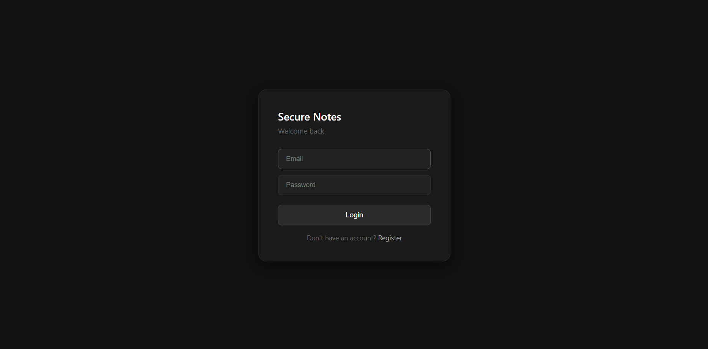
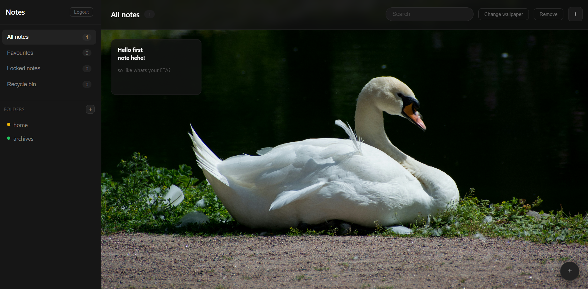
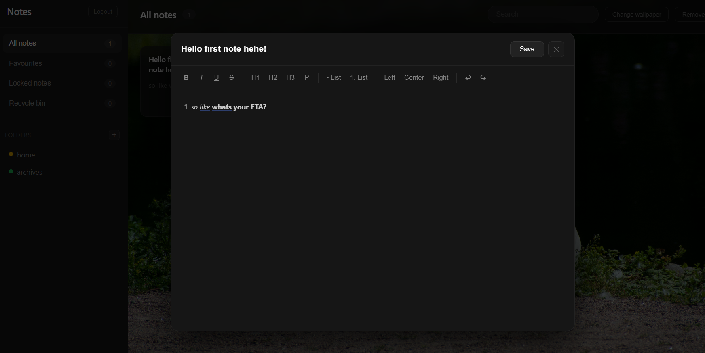

# Secure Notes

[](https://reactjs.org/)
[](https://vitejs.dev/)
[](https://nodejs.org/)
[](https://www.mongodb.com/)
[](https://vercel.com/)

## About
A full-stack encrypted note-taking application where your notes are secured with AES encryption before ever leaving your device. Built with a clean dark UI, rich text editing, and full user authentication.

- **AES Client-Side Encryption** - Notes are encrypted on your device before being sent to the server
- **JWT Authentication** - Secure register and login with bcrypt password hashing
- **Rich Text Editor** - Format notes with bold, italic, headings, lists, and more
- **Folder Organization** - Create color-coded folders to organize your notes
- **Favourites & Locked Notes** - Star important notes and lock sensitive ones
- **Recycle Bin** - Soft delete with recovery support
- **Custom Wallpaper** - Set a personal background for your dashboard
- **Persistent Storage** - Notes and folders saved to MongoDB Atlas

## Interface

| Login | Dashboard | Note Editor |
|---|---|---|
|  |  |  |

## Live Demo
🔗 [secure-notes-gules.vercel.app](https://secure-notes-gules.vercel.app)

## Tech Stack

**Frontend:** React (Vite), React Router, Axios, CryptoJS

**Backend:** Node.js, Express, MongoDB Atlas, Mongoose (Vercel Serverless Functions)

**Auth & Security:** JWT, bcryptjs, AES Encryption

**Deployment:** Vercel (frontend + serverless API)

## Setup

**Prerequisites:**
- Node.js (v18 or higher)
- npm
- MongoDB Atlas account

**Installation:**
```bash
# Clone the repository
git clone https://github.com/arooj-zehra/secure-notes.git

# Navigate to frontend
cd secure-notes/frontend

# Install dependencies
npm install

# Start the development server
npm run dev
```

**Environment Variables:**

Create a `.env` file in the `frontend` folder:
```
MONGO_URI=your_mongodb_connection_string
JWT_SECRET=your_jwt_secret
```

## How Encryption Works

1. When you save a note, the content is encrypted using AES on your device
2. Only the encrypted version is sent to and stored in the database
3. When you open a note, it is decrypted on your device using your session key
4. The server never sees your plain text content

## Features Overview
```
secure-notes/
├── frontend/
│   ├── api/              # Vercel serverless functions (backend)
│   ├── src/
│   │   ├── components/   # Sidebar, NoteCard, NoteEditor
│   │   ├── context/      # AuthContext, NotesContext
│   │   ├── pages/        # Login, Register, Dashboard
│   │   ├── services/     # API calls
│   │   └── utils/        # AES encryption helpers
│   └── vercel.json
└── backend/              # Original Express backend (reference)
```

## 🎧 Project Soundtrack
*This track was on loop while working on this project.*

**["difference" – TAMIW](https://open.spotify.com/track/22hd4ce0p5gWppp5E8zvB9?si=f7aa231c23474c45)**

---

Star this repository if you found it interesting! ⭐

**made with ❤️ by arooj**